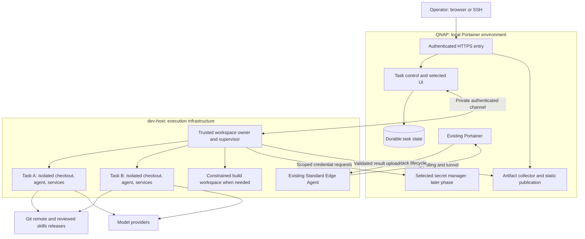

# Implementation plan

## Intended result

Operate several independent coding environments on dev-host from a durable control surface on QNAP. Each task has a reproducible workspace, explicit permissions and resource limits, structured progress, reviewable results, and a clear cleanup policy.

The recommended foundation is Portainer plus portable task workspaces. Evaluate Coder Workspaces for environment management and OpenHands Agent Canvas for agent interaction. Adopt only the components that pass the pilot. The [research report](research.md) provides the evidence and the [decision register](decisions.md) captures unresolved choices.

Status: planning only. No live infrastructure was inspected or changed. Implementation phases below are future work; checked inventory items record confirmed planning inputs only. Effort ranges are engineering estimates, excluding waiting for hardware, credentials, accounts, and product support.

## Architecture target



This is a logical topology, not a claim that a candidate implements every box. If Coder is selected, its workspace state replaces the corresponding custom state and its provisioner owns workspace creation. If Canvas is selected, its backend handles agent interaction; provision one backend per task for the initial isolation model. Any planner backend on QNAP has only planning files and narrow controller operations, not the QNAP Docker socket or NAS shares. Identify gaps before adding a separate task service.

## Phase 0: inventory and decisions

Estimated effort: half to one day. Owner: platform/operator.

- [ ] Record QNAP model, architecture, QTS/QuTS version, container runtime, storage type, spare CPU/RAM, backup method, and private network addresses.
- [x] Record operator-reported dev-host hardware: Intel Ultra 7 265, 64 GiB RAM, RTX 5070 Ti.
- [ ] Verify dev-host OS/kernel, free SSD capacity, Docker/Compose versions, cgroup version, KVM availability, existing workloads, and whether it is itself virtualized. Record GPU driver/runtime and available VRAM if a GPU workload is selected.
- [ ] Read Portainer version, edition/license, exact environment names/IDs/types, Standard Edge connectivity, TLS trust, current resource ownership, and API role capabilities. Inspect credential presence without printing values.
- [x] Select Codex CLI and Claude Code, with 2–5 concurrent workers.
- [ ] Confirm authentication mode and a supported unattended login/refresh path for each runtime; both are required in the initial pilot.
- [ ] Select one representative repository with a fast test suite and a second workload needing a database or browser. Use synthetic development data.
- [ ] Decide private UI access, available domain names, acceptable paid licenses, and the initial threat model: trusted personal repositories or externally supplied code.

Deliverable: complete the [inventory and capacity worksheet](inventory.md), which now records the confirmed hardware and runtime scope. Start with two workers, one Codex CLI and one Claude Code. Use existing authorized read-only deployment diagnostics where configured; do not guess profile names or choose an endpoint by array position.

Exit gate: there is a verified network path between control and execution, enough measured headroom for two representative tasks, and a chosen authentication method. If QNAP cannot comfortably host a candidate control plane, choose a lighter component or explicitly revise its placement before deploying it.

## Phase 1: portable two-worker baseline

Estimated effort: one to two days. Owner: platform.

- [ ] Define a workspace recipe using a pinned image, nonroot user, independent repository clone, task branch, agent version, and read-only skills release.
- [ ] Provision two task environments through one owner. For the baseline, a trusted host-side launcher may render a fixed Compose template; it must reject arbitrary mounts, privileged mode, host networking, and agent-supplied provisioning code.
- [ ] Keep a unique home/state directory, dependency installation, private network, test database, and writable volumes per task. Use the same service ports inside each environment to test collision avoidance.
- [ ] Enforce CPU/RAM/PID limits and verify actual effective values. Add an enforced storage quota where the filesystem supports it; otherwise reserve capacity and implement admission/high-water controls without claiming a hard quota.
- [ ] Run an agent using a documented structured interface under a local supervisor. Record attempt ID, provider session ID, exit status, events, test results, and resulting diff.
- [ ] Verify human access using SSH and an appropriate workspace terminal. Add mosh only if roaming access is valuable and the UDP path is explicitly available.
- [ ] Copy artifacts through a constrained collector to an immutable QNAP directory, then stop and remove the workspace while retaining its results.

Suggested pilot settings, to tune after measuring: two workers (one per runtime), one heavy build at a time, two vCPU-equivalent CPU limits and 4 GiB memory per ordinary worker, 60-minute execution timeout, 24-hour review retention before stopping, and seven-day workspace deletion eligibility. The memory limit must include or separately account for task databases, browsers, and other sidecars. The [capacity worksheet](inventory.md#provisional-capacity-budget) reserves headroom within the reported 64 GiB and describes expansion to five workers. These are proposed limits, not evidence of sufficient capacity. Stop and delete are separate operations.

Exit gate: both workers can alter the same relative filename, listen on the same internal port, and migrate their own databases without affecting each other. A worker cannot access a sibling checkout, host Docker socket, operator credentials, or NAS administration endpoint. Results remain accessible after destruction.

## Phase 2: select the workspace owner and operator UI

Estimated effort: two to three days, timeboxed. Owner: platform plus operator evaluation.

Run the same tasks and failure scenarios through the candidates for both Codex CLI and Claude Code. Exercise a mixed five-worker run after the two-worker baseline passes. Record exact versions/digests and distinguish built-in behavior from custom glue.

| Candidate experiment | Required proof | Decision rule |
|---|---|---|
| Coder Workspaces | Remote dev-host provisioning, persistent checkout, browser/IDE access, resource limits, stop/start and delete, correct ownership | Adopt if topology and edition work within the budget |
| OpenHands Agent Canvas | Separate task backends, selected CLI adapter, authenticated remote access, questions/approvals, resume, cancellation, artifact links, and browser credential isolation | Adopt if it meaningfully reduces UI/adapter work and resolves the documented editor-origin risk |
| Docker Sandboxes | Supported host/KVM, noninteractive creation, container build/test inside sandbox, scoped sharing, cleanup and export | Adopt for the strong-isolation/build class if it passes |
| Minimal native runner | Structured events, task index, private terminal access, deterministic lifecycle | Retain if platforms fail key requirements or add disproportionate administration |

Do not make Coder's native agent a mandatory substitute for preferred CLIs. Do not assume Canvas supplies global scheduling because it can switch backends. Confirm Coder's external provisioner entitlement; if unavailable, test an explicitly secured Community topology or reject it. Avoid stacking Coder and a second workspace provisioner over the same resources.

Canvas's self-hosting guide documents that its bundled editor shares an origin with stored backend keys. Use disposable pilot credentials and require a supported, tested mitigation before adopting a shared multi-backend UI. Merely moving the editor to another URL path does not meet that gate. See the [Canvas assessment](research.md#openhands-agent-canvas).

Decision output: update D03–D05 in the [register](decisions.md), identify the chosen owner for every resource, and write one page of measured advantages and remaining gaps. Vibe Kanban and the unmaintained Daytona public core are not deployment candidates for this phase.

Exit gate: the selected composition has a supported recovery path, a clear version/update policy, and no hidden licensing dependency. Stop evaluating new products after this gate unless a measured failure reopens a decision.

## Phase 3: durable orchestration

Estimated effort: two to four days if the selected platform leaves gaps. Owner: platform.

Reuse the chosen platform's API and database wherever possible. Only build a small control service if required. For a custom single-host pilot, SQLite on a local filesystem is a possible start; use PostgreSQL when multiple services or transactional leases require it. Do not put SQLite on a shared NAS network mount. Avoid adding Redis or a workflow engine solely for two workers.

- [ ] Persist task, workspace, session, attempt, event, approval, grant reference, artifact, and lease records. Store secret references only.
- [ ] Validate incoming manifests against platform-owned project/runtime/resource profiles. Resolve branch references to immutable commits before scheduling.
- [ ] Implement idempotent submit/start/cancel, an append-only event sequence, heartbeats, and reconciliation after reconnect.
- [ ] Make cancellation stop the full process group or task container, then verify no tests/servers remain. Keep cancellation pending until the worker confirms it.
- [ ] Implement `awaiting_input` with an explicit question/approval ID. A disconnected UI must not implicitly approve anything.
- [ ] Enforce concurrency, wall time, provider backoff, and an emergency stop for new dispatch. Agent suggestions cannot increase their own grants or budgets.
- [ ] On controller restart, reconcile in-flight attempts before issuing work. A lost lease is not permission to reuse the same writable workspace concurrently.

Proposed interface, not an existing API:

```text
submit(task, idempotency_key) -> task_id
start(attempt_id, workspace_id, lease_generation) -> acknowledgement
events(attempt_id, after_sequence) -> ordered events
answer(question_id, response) -> recorded decision
cancel(attempt_id) -> requested | confirmed
collect(attempt_id) -> immutable artifact manifest
reconcile(host_id) -> observed attempts and workspaces
```

A worker should continue already authorized bounded work during a short QNAP outage, spool events locally with a size limit, and stop at its local deadline. New credential grants and new tasks wait for control-plane recovery. Never retry deployment or other external side effects solely because a response was lost; verify observed state first.

Exit gate: controller and supervisor restart tests produce no duplicate active attempt, no silently lost result, and an accurate final state. A long-running test and a waiting human question are distinguishable from a dead worker.

## Phase 4: credential and skills delivery

Estimated effort: one to three days. Owner: platform/operator.

- [ ] Pilot one secret manager: Infisical first for the UI-oriented workflow, or OpenBao if machine-policy requirements justify its operating model. Verify the selected edition's required controls.
- [ ] Define separate project/role grants for source access, model use, artifacts, and release operations. Add short-lived tokens where supported and document static-key exceptions.
- [ ] Keep bootstrap identity in the trusted supervisor or release service, with an independent recovery procedure. Never put secret-store admin access in a worker image or task manifest.
- [ ] Exercise credential expiry, renewal, revocation, and secret-store outage. Verify both token revocation and underlying-key rotation behavior.
- [ ] Create a versioned shared-skills source with a release digest and runtime compatibility checks. Pin the reviewed Portainer gist revision; do not auto-update live skills.
- [ ] Make agent home/state isolated and test the selected auth mode across concurrent workers. Check refresh behavior without exposing token values.

For the initial two-worker pilot, a properly protected host credential store and narrow process injection can precede deploying a secret service. This is a bootstrap stage with documented rotation, not a reason to keep copying plaintext `.env` files between projects.

Exit gate: rotating a project credential affects new runs predictably, workers cannot enumerate other project secrets, and an interrupted secret service can be recovered without requiring itself to provide its bootstrap credentials.

## Phase 5: artifacts, previews, and integration

Estimated effort: one to two days. Owner: platform plus project maintainers.

- [ ] Publish immutable plans, diffs, screenshots, and test reports with task/attempt IDs, digests, timestamps, and source/environment provenance.
- [ ] Add a private task index linking the chosen UI, artifacts, and Git review. Use authenticated static publication before introducing object storage.
- [ ] Isolate active HTML/previews from the control-plane origin and cookies. Reject unsafe upload paths, symlinks, oversized artifacts, and invalid route targets.
- [ ] Add expiring preview routes and ensure task databases remain private. Verify WebSocket and browser authentication behavior.
- [ ] Introduce task-branch publishing if needed, with protected base branches and one integration queue. Build/test the integrated commit, not just the individual patches.
- [ ] Connect approved releases to the existing Portainer deployment skill. Record exact stack, artifact digest, verification, and rollback reference. Routine coding workers do not receive release credentials.

Exit gate: a fresh browser can review a completed task after its workspace is destroyed; active preview content cannot access control-plane credentials; a merged result has its own verification evidence.

## Phase 6: operations and capacity

Estimated effort: one to two days, then a representative working-week soak. Owner: platform.

- [ ] Add infrastructure metrics, queue/attempt health, provider errors, artifact failures, and backup freshness. Use Prometheus/Grafana if existing or justified; keep high-cardinality task data in the task store.
- [ ] Set log and artifact retention, admission thresholds, and safe cleanup. Require artifact capture and a dirty/unpushed-work check before destructive workspace cleanup.
- [ ] Back up databases, skill/config releases, results, and secret recovery material. Restore onto a clean location and verify links and credentials independently.
- [ ] Define upgrade/canary/rollback procedures for agent binaries, wrappers, workspace images, and platform services.
- [ ] Measure start latency, peak RAM, disk growth, test contention, useful completion rate, and operator time spent recovering jobs. Increase concurrency only from those measurements.

Exit gate: no unexplained orphan resources or missing results during the soak, bounded disk use, a demonstrated restore, and documented behavior when QNAP or dev-host is unavailable. A useful initial service objective is that accepted tasks are never silently dropped; recovery time and retention targets should be set after measurement.

## Acceptance scenarios

| ID | Scenario | Required evidence |
|---|---|---|
| A01 | Same repository, two simultaneous edits | Separate branches/checkouts; deterministic review artifacts |
| A02 | Same app ports and database names | No collision or shared data across task boundaries |
| A03 | Worker probes forbidden resources | Sibling files, host socket, NAS admin, and unrelated secrets inaccessible |
| A04 | Agent requires operator input | Visible pending question; answer tied to exact attempt |
| A05 | Cancel during a test spawning children | No remaining task processes; correct cancelled state |
| A06 | Restart QNAP controller during execution | Existing bounded work reconciles; no duplicate start |
| A07 | Restart supervisor / lose dev-host | Explicit recovered or lost state; no unverified replay |
| A08 | Expire/revoke credentials mid-task | Bounded failure or supported renewal; no secret in logs |
| A09 | Agent exits zero but tests fail | Failed verification, never automatic success |
| A10 | Delete worker after collecting results | Plan, patch, provenance, and reports still readable |
| A11 | Submit unsafe artifact and preview content | Path escape rejected; browser credential boundary holds |
| A12 | Merge two individually passing changes | Integration environment tests actual combined commit |
| A13 | Disk pressure / quota exhaustion | New work refused or stopped cleanly; durable state protected |
| A14 | Restore control state and artifacts from backup | Task records and results usable without original runtime |
| A15 | Agent/adapter version upgrade | Events, approvals, auth, and resume pass before broad rollout |

## First implementation slice

The next concrete step is Phase 0 followed by one fixed two-worker recipe and result collector. That establishes the real hardware and agent constraints while producing reusable workspaces for the Coder/Canvas comparison. Defer a custom web application until the comparison records the specific capabilities missing from existing software.
